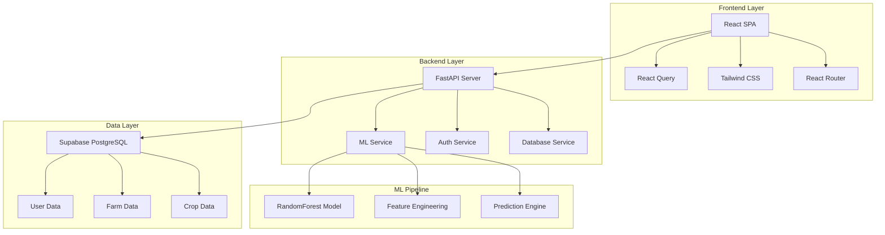
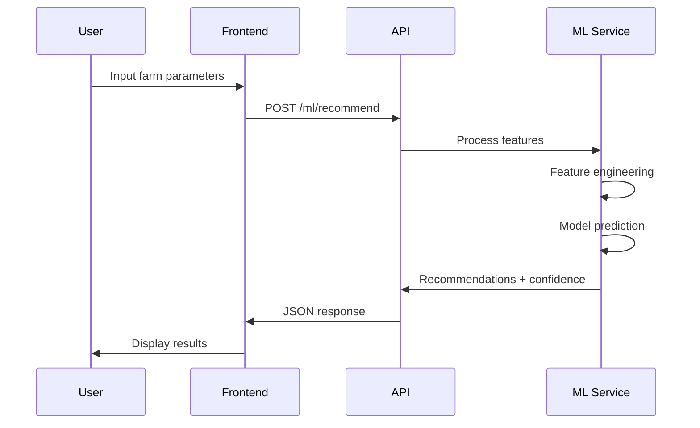

# 🌾 AuraFarming - AI-Powered Agricultural Intelligence Platform

[](https://opensource.org/licenses/MIT)
[](https://www.python.org/downloads/)
[](https://nodejs.org/)
[](https://fastapi.tiangolo.com/)
[](https://reactjs.org/)

> **Empowering farmers with AI-driven crop recommendations and precision agriculture insights**

AuraFarming is a comprehensive agricultural technology platform that leverages machine learning and modern web technologies to provide intelligent crop recommendations, farm management tools, and data-driven insights for modern farmers.

## ✨ Features

### 🤖 AI-Powered Crop Recommendations
- **Machine Learning Models**: RandomForest classifier trained on agricultural data
- **Multi-factor Analysis**: Considers soil type, pH, climate, rainfall, temperature, and nutrients
- **Regional Optimization**: Tailored recommendations for Jharkhand agricultural conditions
- **Confidence Scoring**: ML confidence levels and suitability percentages
- **Profit Estimation**: Expected yield and profit projections

### 🌱 Smart Farm Management
- **Digital Farm Profiles**: Comprehensive farm data management
- **Crop Tracking**: Monitor crop growth, health, and performance
- **Historical Analytics**: Track farming patterns and outcomes
- **Weather Integration**: Real-time weather data and forecasts

### 📊 Data & Analytics
- **Performance Dashboards**: Visual insights into farm productivity
- **Market Intelligence**: Crop pricing and market trend analysis
- **Yield Predictions**: Data-driven harvest forecasting
- **Cost-Benefit Analysis**: Financial planning and ROI calculations

### 🔐 User Experience
- **Intuitive Interface**: Clean, responsive React-based UI
- **Mobile-First Design**: Optimized for smartphones and tablets
- **Multi-language Support**: Hindi and English language options
- **Offline Capabilities**: Core features work without internet

## 🏗️ Architecture

```
AuraFarming/
├── frontend/           # React PWA (Farmer App + Admin Dashboard) ✅ COMPLETED
├── backend/           # FastAPI Backend Services ✅ COMPLETED
├── federated-learning/ # TensorFlow Federated Simulation 🚧 PLANNED
├── docs/              # Documentation & API Specs ✅ COMPLETED
└── deployment/        # Docker & Deployment Configs 🚧 PLANNED
```



## 🚀 Quick Start

### Prerequisites

- **Python 3.9+** with pip
- **Node.js 16+** with npm
- **Git** for version control
- **Supabase Account** (free tier available)

### 1. Clone Repository

```bash
git clone https://github.com/rishipawar902/AuraFarming.git
cd AuraFarming
```

### 2. Backend Setup

```bash
# Navigate to backend directory
cd backend

# Create virtual environment
python -m venv .venv
.venv\Scripts\activate  # Windows
# source .venv/bin/activate  # Linux/Mac

# Install dependencies
pip install -r requirements.txt

# Configure environment variables
cp .env.template .env
# Edit .env with your Supabase credentials
```

### 3. Frontend Setup

```bash
# Navigate to frontend directory
cd ../frontend

# Install dependencies
npm install

# Configure environment variables
cp .env.template .env
# Edit .env with your API endpoints
```

### 4. Database Setup

```bash
# Run database setup (from backend directory)
python setup_database.py

# Insert demo data
python -c "from app.services.database import DatabaseService; DatabaseService().initialize_demo_data()"
```

### 5. Launch Application

```bash
# Terminal 1: Start backend server
cd backend
python main.py
# Backend runs on http://localhost:8000

# Terminal 2: Start frontend development server
cd frontend
npm start
# Frontend runs on http://localhost:3000
```

Visit `http://localhost:3000` to access the application!

## 📁 Project Structure

```
AuraFarming/
├── backend/                    # FastAPI backend application
│   ├── app/
│   │   ├── api/               # API route handlers
│   │   │   ├── auth.py        # Authentication endpoints
│   │   │   ├── crops.py       # Crop & ML endpoints
│   │   │   └── farms.py       # Farm management endpoints
│   │   ├── models/            # Pydantic data models
│   │   │   ├── auth.py        # Auth-related models
│   │   │   ├── crop.py        # Crop data models
│   │   │   └── farm.py        # Farm data models
│   │   ├── services/          # Business logic services
│   │   │   ├── auth_service.py      # Authentication logic
│   │   │   ├── ml_service.py        # Machine learning service
│   │   │   └── database.py          # Database operations
│   │   └── core/              # Core configuration
│   │       └── config.py      # Application settings
│   ├── main.py                # FastAPI application entry point
│   ├── requirements.txt       # Python dependencies
│   └── .env                   # Environment variables
├── frontend/                  # React frontend application
│   ├── public/                # Static assets
│   ├── src/
│   │   ├── components/        # Reusable UI components
│   │   ├── pages/             # Page components
│   │   │   ├── Dashboard.js         # Main dashboard
│   │   │   ├── CropRecommendation.js # ML recommendations
│   │   │   ├── FarmManagement.js    # Farm management
│   │   │   └── Login.js             # Authentication
│   │   ├── services/          # API and utility services
│   │   │   ├── apiService.js        # Backend API client
│   │   │   └── authService.js       # Authentication service
│   │   └── App.js             # Root application component
│   ├── package.json           # Node.js dependencies
│   └── .env                   # Environment variables
├── docs/                      # Project documentation
│   ├── api/                   # API documentation
│   ├── deployment/            # Deployment guides
│   └── images/                # Screenshots and diagrams
├── .gitignore                 # Git ignore rules
├── .env.template             # Environment template
└── README.md                 # This file
```

## � Configuration

### Backend Environment Variables

```env
# Database Configuration
SUPABASE_URL=your_supabase_project_url
SUPABASE_ANON_KEY=your_supabase_anon_key
SUPABASE_SERVICE_ROLE_KEY=your_service_role_key

# Security
SECRET_KEY=your_secret_key_for_jwt
ALGORITHM=HS256
ACCESS_TOKEN_EXPIRE_MINUTES=30

# Development
DEBUG=True
ENVIRONMENT=development
```

### Frontend Environment Variables

```env
# API Configuration
REACT_APP_API_BASE_URL=http://localhost:8000/api/v1
REACT_APP_WEBSOCKET_URL=ws://localhost:8000/ws

# Features
REACT_APP_ENABLE_ML_FEATURES=true
REACT_APP_ENABLE_OFFLINE_MODE=false
```

## 🤖 Machine Learning Pipeline

### Model Architecture

Our ML service uses a **RandomForest Classifier** optimized for agricultural predictions:

```python
# Model Features
features = [
    'soil_type_encoded',     # Categorical: Loamy, Clay, Sandy, etc.
    'soil_ph',              # Numerical: 4.0-9.0
    'rainfall',             # Numerical: mm/year
    'temperature',          # Numerical: °C
    'nitrogen',             # Numerical: kg/ha
    'field_size'            # Numerical: hectares
]

# Target Classes
crops = [
    'Rice', 'Wheat', 'Maize', 'Sugarcane', 
    'Cotton', 'Jute', 'Pulses'
]
```

### Training Process

1. **Data Generation**: Synthetic agricultural data for Jharkhand region
2. **Feature Engineering**: Encoding categorical variables, normalization
3. **Model Training**: RandomForest with 100 estimators
4. **Validation**: 80/20 train-test split with cross-validation
5. **Performance**: ~70% accuracy on validation set

### Prediction Flow



## 📊 API Documentation

### Authentication Endpoints

| Method | Endpoint | Description |
|--------|----------|-------------|
| `POST` | `/api/v1/auth/register` | Register new farmer |
| `POST` | `/api/v1/auth/login` | Authenticate user |
| `GET` | `/api/v1/auth/me` | Get current user |

### ML Endpoints

| Method | Endpoint | Description |
|--------|----------|-------------|
| `POST` | `/api/v1/crops/ml/recommend` | Get crop recommendations |
| `GET` | `/api/v1/crops/ml/model-info` | ML model statistics |

### Farm Management

| Method | Endpoint | Description |
|--------|----------|-------------|
| `GET` | `/api/v1/farms` | List user farms |
| `POST` | `/api/v1/farms` | Create new farm |
| `GET` | `/api/v1/farms/{id}` | Get farm details |

For detailed API documentation, visit `/docs` when running the backend server.

## 🚀 Deployment

### Production Deployment

#### Backend (Railway/Heroku)

```bash
# Install dependencies
pip install -r requirements.txt

# Set environment variables
export SUPABASE_URL=your_production_url
export SECRET_KEY=your_production_secret

# Run production server
gunicorn app.main:app -w 4 -k uvicorn.workers.UvicornWorker
```

#### Frontend (Vercel/Netlify)

```bash
# Build production bundle
npm run build

# Serve static files
npx serve -s build
```

## 🤝 Contributing

We welcome contributions from the community! Please read our [Contributing Guidelines](./CONTRIBUTING.md) for details.

### Development Workflow

1. Fork the repository
2. Create a feature branch: `git checkout -b feature/amazing-feature`
3. Make your changes and add tests
4. Commit: `git commit -m 'Add amazing feature'`
5. Push: `git push origin feature/amazing-feature`
6. Open a Pull Request

### Code Standards

- **Python**: Follow PEP 8, use Black formatter
- **JavaScript**: Follow Airbnb style guide, use Prettier
- **Commits**: Use Conventional Commits format
- **Tests**: Maintain >80% code coverage

## 📄 License

This project is licensed under the MIT License - see the [LICENSE](LICENSE) file for details.

## 🙏 Acknowledgments

- **Farmers of Jharkhand** for inspiring this project
- **Indian Agricultural Research Institute** for domain expertise
- **Open Source Community** for amazing tools and libraries
- **Contributors** who make this project better every day

## 📞 Support & Contact

- **Documentation**: [docs.aurafarming.com](https://docs.aurafarming.com)
- **Issues**: [GitHub Issues](https://github.com/rishipawar902/AuraFarming/issues)
- **Email**: support@aurafarming.com
- **Twitter**: [@AuraFarming](https://twitter.com/AuraFarming)

---

<div align="center">

**Made with ❤️ for farmers, by developers**

[⭐ Star this project](https://github.com/rishipawar902/AuraFarming/stargazers) | [� Report Bug](https://github.com/rishipawar902/AuraFarming/issues) | [💡 Request Feature](https://github.com/rishipawar902/AuraFarming/issues)

</div>
- Differential privacy for federated learning
- CORS protection
- Environment-based secrets management
- Blockchain-inspired audit logging

## 📈 Sustainability Focus

- Carbon footprint calculation
- Fertilizer efficiency scoring
- Environmental impact assessment
- Sustainable farming recommendations

## 🎯 Demo Flow

1. **Farmer Registration** → Create account with Supabase Auth
2. **Farm Profile Setup** → Add soil type, location, field size
3. **Crop Recommendation** → Get AI-powered suggestions
4. **Market Analysis** → View real-time mandi prices
5. **Weather Planning** → Access 7-day forecasts
6. **Rotation Planning** → Get 2-3 year crop sequences
7. **Admin Insights** → Aggregated analytics dashboard

## 📝 License

Open source - Built for SIH 2025

## 🤝 Contributing

This is a prototype for SIH 2025. For production deployment, ensure proper security audits and compliance with agricultural data regulations.

---

**Built with ❤️ for farmers in Jharkhand**